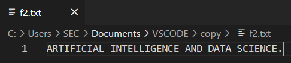

# Copy File form another file
## AIM:
To write a python program for copying the contents from one file to another file.
## EQUIPEMENT'S REQUIRED: 
PC,Anaconda - Python 3.7
## ALGORITHM: 
- Step 1:
Open the file f1 in read mode.
- Step 2: 
Open the file f2 in append mode. 
- Step 3: 
Copy the contents using write() with the for loop.
- Step 4:  
End the program.
## PROGRAM:
```Python
#Developed By: ROHIT JAIN D
#Register No: 212222230120
with open('f1.txt','r') as f1:
    with open ('f2.txt','a') as f2:
        for line in f1:
            f2.write(line)
```
### OUTPUT:
File 1:  
  
File 2:  
  
File 1 copied into File 2

## RESULT:
Thus the program is written to copy the contents from one file to another file.